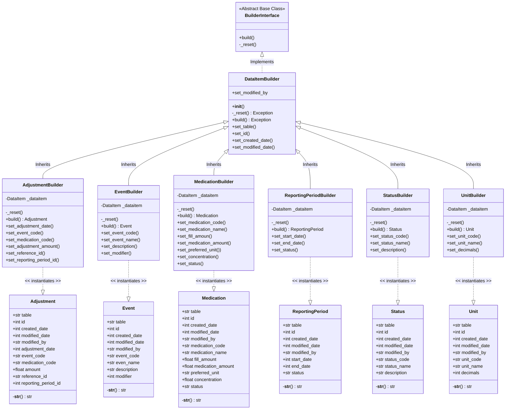

# Builders Package: Relationship Class Diagram

```mermaid
classDiagram

BuilderInterface <|.. DataItemBuilder : Implements

    class BuilderInterface {
        <<Abstract Base Class>>
        +build()
        -_reset()
    }

    class DataItemBuilder {
        +__init__()
        -_reset() Exception
        +build() Exception
        +set_table()
        +set_id()
        +set_created_date()
        +set_modified_date()
        +set_modified_by 
    }
    
DataItemBuilder <|-- AdjustmentBuilder : Inherits

    class AdjustmentBuilder {
        -DataItem _dataitem
        -_reset()
        +build() Adjustment
        +set_adjustment_date()
        +set_event_code()
        +set_medication_code()
        +set_adjustment_amount()
        +set_reference_id()
        +set_reporting_period_id()
    }

DataItemBuilder <|-- EventBuilder : Inherits

    class EventBuilder {
        -DataItem _dataitem
        -_reset()
        +build() Event
        +set_event_code()
        +set_event_name()
        +set_description()
        +set_modifier()
    }

DataItemBuilder <|-- MedicationBuilder : Inherits

    class MedicationBuilder {
        -DataItem _dataitem
        -_reset()
        +build() Medication
        +set_medication_code()
        +set_medication_name()
        +set_fill_amoun()
        +set_medication_amount()
        +set_preferred_unit())
        +set_concentration()
        +set_status()
    }

DataItemBuilder <|-- ReportingPeriodBuilder : Inherits

    class ReportingPeriodBuilder {
        -DataItem _dataitem
        -_reset()
        +build() ReportingPeriod
        +set_start_date()
        +set_end_date()
        +set_status()
    }

DataItemBuilder <|-- StatusBuilder : Inherits

    class StatusBuilder {
        -DataItem _dataitem
        -_reset()
        +build() Status
        +set_status_code()
        +set_status_name()
        +set_description()
    }

DataItemBuilder <|-- UnitBuilder : Inherits

    class UnitBuilder {
        -DataItem _dataitem
        -_reset()
        +build() Unit
        +set_unit_code()
        +set_unit_name()
        +set_decimals()
    }

AdjustmentBuilder ..|> Adjustment : << instantiates >>

    class Adjustment {
        +str table
        +int id
        +int created_date
        +int modified_date
        +str modified_by
        +int adjustment_date
        +str event_code
        +str medication_code
        +float amount
        +str reference_id
        +int reporting_period_id
        -__str__() str
    }

EventBuilder ..|> Event : << instantiates >>

    class Event {
        +str table
        +int id
        +int created_date
        +int modified_date
        +str modified_by
        +str event_code
        +str even_name
        +str description 
        +int modifier
        -__str__() str
    }

MedicationBuilder ..|> Medication : << instantiates >>

    class Medication {
        +str table
        +int id
        +int created_date
        +int modified_date
        +str modified_by
        +str medication_code
        +str medication_name
        +float fill_amount
        +float medication_amount
        +str preferred_unit
        +float concentration
        +str status
        -__str__() str
    }

ReportingPeriodBuilder ..|> ReportingPeriod : << instantiates >>

    class ReportingPeriod {
        +str table
        +int id
        +int created_date
        +int modified_date
        +str modified_by
        +int start_date
        +int end_date
        +str status
        -__str__() str
    }

StatusBuilder ..|> Status : << instantiates >>

    class Status {
        +str table
        +int id
        +int created_date
        +int modified_date
        +str modified_by
        +str status_code
        +str status_name
        +str description
        -__str__() str
    }

UnitBuilder ..|> Unit : << instantiates >>

    class Unit {
        +str table
        +int id
        +int created_date
        +int modified_date
        +str modified_by
        +str unit_code
        +str unit_name
        +int decimals
        -__str__() str
    }
```