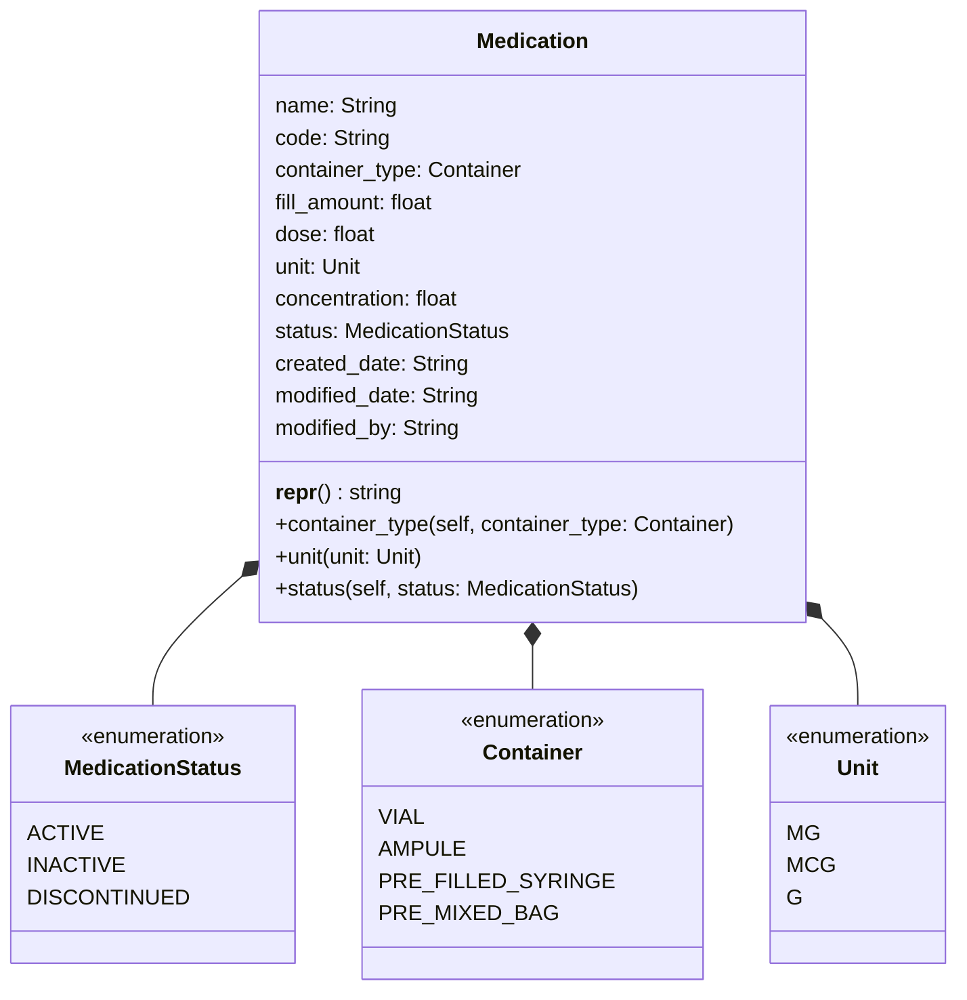

# Medication Feature Class Diagram

```mermaid
classDiagram
    class Medication {
        name: String
        code: String
        container_type: Container
        fill_amount: float
        dose: float
        unit: Unit
        concentration: float
        status: MedicationStatus
        created_date: String
        modified_date: String
        modified_by: String

        __repr__() string
        +container_type(self, container_type: Container)
        +unit(unit: Unit)
        +status(self, status: MedicationStatus)
    }

    class MedicationStatus {
        <<enumeration>>
        ACTIVE
        INACTIVE
        DISCONTINUED
    }

    class Container {
        <<enumeration>>
        VIAL
        AMPULE
        PRE_FILLED_SYRINGE
        PRE_MIXED_BAG
    }

    class Unit {
        <<enumeration>>
        MG
        MCG
        G
    }

    Medication *-- MedicationStatus
    Medication *-- Container
    Medication *-- Unit

```
