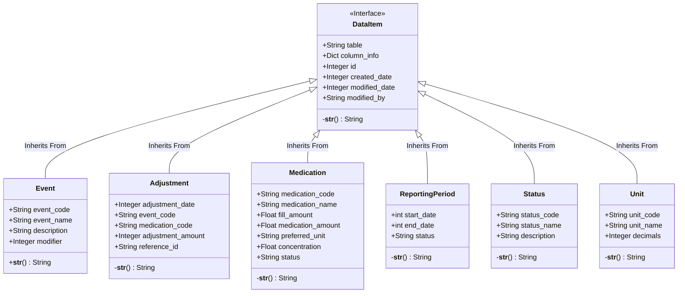

Mermaid Code!

```mermaid
classDiagram

class DataItem {
    <<Interface>>
    +String table
    +Dict column_info
    +Integer id
    +Integer created_date
    +Integer modified_date
    +String modified_by
    -__str__() String
}


class Adjustment {
    +Integer adjustment_date
    +String event_code
    +String medication_code
    +Integer adjustment_amount
    +String reference_id
    -__str__() String
}

class Event {
    +String event_code
    +String event_name
    +String description
    +Integer modifier
    +__str__() String
}


class Medication {
    +String medication_code
    +String medication_name
    +Float fill_amount
    +Float medication_amount
    +String preferred_unit
    +Float concentration
    +String status
    -__str__() String
}


class ReportingPeriod {
    +int start_date
    +int end_date
    +String status
    -__str__() String
}

class Status {
    +String status_code
    +String status_name
    +String description
    -__str__() String
}

class Unit {
    +String unit_code
    +String unit_name
    +Integer decimals
    -__str__() String
}


DataItem <|-- Event : Inherits From
DataItem <|-- Adjustment : Inherits From
DataItem <|-- Medication : Inherits From
DataItem <|-- ReportingPeriod : Inherits From
DataItem <|-- Status : Inherits From
DataItem <|-- Unit : Inherits From


```
